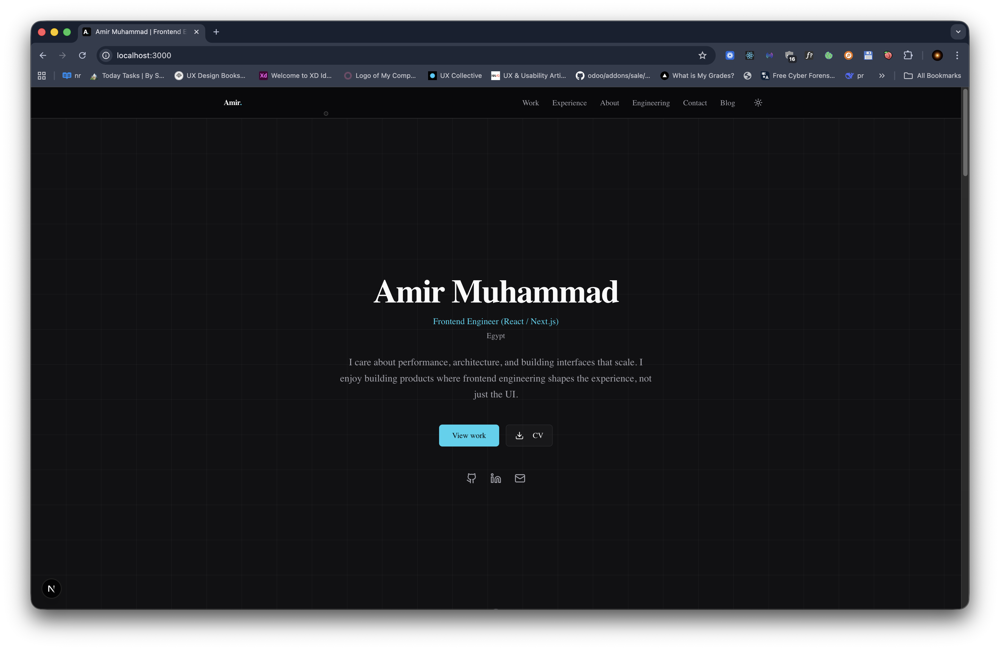

# Amir's Portfolio Architecture

A production-grade developer portfolio built with Next.js 16. It features a custom static Markdown blog system, dual-theme syntax highlighting, automated SEO optimization, and a highly polished framer-motion UI.


*(Note: Replace `preview.png` with an actual screenshot of the live site before publishing)*

## Live Demo

**[amirmuhammad.dev](https://amirmuhammad.dev)**

Visit the live site to experience the polished UI micro-interactions, the smooth scrolling architecture, and the responsive dual-theme blog system.

## What This Project Is

This repository contains the complete source code for my personal portfolio and blog. It was built to serve as a high-performance, statically generated home on the internet that doesn't rely on a heavy CMS or third-party blogging platform. 

Instead of reaching for off-the-shelf templates, I built the underlying systems from scratch. The blog engine parses local Markdown files, performs server-side syntax highlighting with Shiki, and automatically generates Open Graph images and JSON-LD structured data for every post. The UI is built with a focus on typography, spacing, and subtle animations that enhance rather than distract from the content.

This project is open-sourced as a reference architecture for other developers looking to build a production-ready static site using the Next.js App Router, Tailwind CSS v4, and minimal dependencies.

## Tech Stack

| Layer | Technology |
|---|---|
| **Framework** | Next.js 16 (App Router) |
| **Language** | TypeScript 5 |
| **Styling** | Tailwind CSS 4 |
| **UI Components**| Radix UI primitives (`shadcn/ui`) |
| **Animation** | Framer Motion |
| **Content** | Markdown (`gray-matter`, `remark`, `rehype`) |
| **Syntax Highlighting** | Shiki (`rehype-shiki`) |
| **Analytics** | Vercel Analytics |

## Project Structure

```
/
├── app/                  # Next.js App Router pages and layouts
│   ├── blog/             # Blog index, dynamic post routes, and OG image generation
│   ├── site-map/         # HTML sitemap page for users
│   ├── layout.tsx        # Root layout with dual-theme providers
│   ├── page.tsx          # Main landing page assembling UI sections
│   └── sitemap.ts        # Dynamic XML sitemap generator for crawlers
├── components/           # Reusable UI components
│   ├── ui/               # Radix UI primitives / shadcn components
│   ├── header.tsx        # Main navigation header
│   ├── hero.tsx          # Landing hero section with animations
│   └── ...               # Section components (about, experience, work, etc.)
├── content/
│   └── blog/             # Markdown blog posts — add new .md files here
├── lib/
│   ├── blog.ts           # Core blog engine parsing Markdown and generating raw HTML
│   ├── site.ts           # Single source of truth for site configuration and content strings
│   └── motion.ts         # Shared Framer Motion variants and viewport configs
├── public/               # Static assets (PDFs, images, robots.txt)
└── styles/
    └── globals.css       # Tailwind entry point and root CSS variables
```

## How It Works

### Custom Markdown Blog Engine
The blog avoids heavy CMS dependencies by parsing local Markdown files.

- Posts are written in `./content/blog/*.md` with a required YAML frontmatter schema (title, description, date, tags, slug).
- The `lib/blog.ts` utility uses `gray-matter` to parse the frontmatter and `remark`/`rehype` to convert the markdown body directly to HTML at build time.
- The dynamic route `app/blog/[slug]/page.tsx` uses `generateStaticParams` to fetch all available slugs and generate the pages statically, ensuring instant load times in production.

### Server-Side Syntax Highlighting
Code blocks in blog posts are highlighted using `shiki`.

- Highlighting happens purely server-side during the build step. No heavy client-side highlighting libraries are shipped.
- The engine uses a custom regex replacement in `lib/blog.ts` to inject CSS variables, mapping the code blocks to both `github-light` and `github-dark` themes simultaneously. This ensures the code always perfectly matches the user's active theme without flickering or requiring a client-side re-render.

### Automated Technical SEO
Every page and blog post is heavily optimized for search engines and social sharing.

- **Dynamic Open Graph Images:** The route `app/blog/[slug]/opengraph-image.tsx` uses `next/og` to automatically generate a unique 1200x630 sharing card for every single blog post, featuring the post's title and branding.
- **JSON-LD Structured Data:** The blog post layout injects `application/ld+json` script tags with strict `Article` schema, including the author, publication date, and keyword tags.
- **Auto-generated XML Sitemap:** The `app/sitemap.ts` file automatically iterates over the static routes and all parsed blog slugs to keep search engines up to date.

### Component Architecture & Animation
The UI is composed of isolated, reusable section components.

- `lib/site.ts` acts as a central CMS for all static strings on the homepage (experience timeline, project links, about details). This isolates content updates from structural component changes.
- Animations use `framer-motion` variants defined in `lib/motion.ts`. Elements utilize `whileInView` and `viewport={{ once: true, margin: "-100px" }}` to trigger staggered, elegant fade-ins only when the user scrolls them into the viewport.

## Getting Started

To run this project locally, you will need Node.js and `pnpm` installed.

```bash
# Clone the repository
git clone https://github.com/your-username/your-repo.git
cd your-repo

# Install dependencies
pnpm install

# Start the development server
pnpm dev
```

Then open [http://localhost:3000](http://localhost:3000) in your browser.

## Environment Variables

For local development, copy the example environment file:

```bash
cp .env.example .env.local
```

| Variable | Description | Example |
|---|---|---|
| `NEXT_PUBLIC_SITE_URL` | The absolute URL of your deployment. Crucial for generating valid Open Graph image URLs and sitemaps. | `https://amirmuhammad.dev` |

## Adding Blog Posts

To publish a new blog post, simply create a new Markdown file in the `content/blog` directory. The filename doesn't matter, but the `slug` in the frontmatter determines the URL.

The engine requires the following exact YAML frontmatter block at the top of the file:

```markdown
---
title: "The Title of Your Post"
description: "A short, 1-2 sentence description for the meta tags and index preview."
date: 2025-02-10
tags: ["frontend", "architecture"]
slug: the-title-of-your-post
---

Write your markdown content here. Code blocks will automatically be syntax-highlighted...
```

When you save the file, the dev server will hot-reload it instantly. In production, adding a file and pushing to your `main` branch will trigger a Vercel rebuild, statically generating the new HTML page and OG image.

## Deployment

The project is designed to be deployed to [Vercel](https://vercel.com/) with zero configuration.

1. Push your code to a GitHub repository.
2. Import the project in your Vercel dashboard.
3. The Build Command (`next build`) and Output Directory (`.next`) will be detected automatically.
4. **Crucial:** Add the `NEXT_PUBLIC_SITE_URL` environment variable in your Vercel project settings, mapped to your exact production domain.

## Contributing

This project is open source primarily as a reference architecture. Bug fixes, accessibility improvements, and performance optimizations are always welcome — please open an issue to discuss before starting significant structural changes.

- Ensure you have `pnpm` installed.
- Maintain the strict TypeScript config (no `any` types).
- Run `pnpm lint` and `pnpm build` to verify standard compliance before submitting a pull request.

## License

MIT License — see LICENSE for details.

---
**Author:** Amir Muhammad  
**Links:** [Website](https://amirmuhammad.dev)
